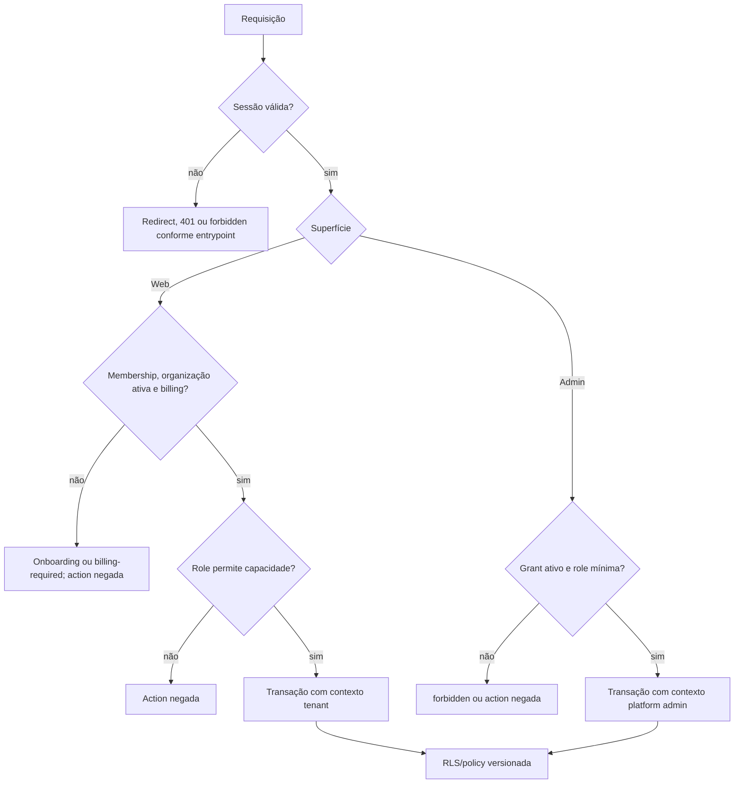

# Modelo de autorização

**Status:** guards e políticas versionadas confirmados; infraestrutura externa e efetivação no banco promovido não confirmadas.
**Última verificação:** 2026-07-14.
**Commit analisado:** `886eda0` em `main`.

## Princípio

Autorização não é decidida pelo cliente nem apenas pelo `proxy`. O web combina sessão, membership/organização ativa, billing, role e contexto tenant; o admin combina sessão, grant de platform admin e contexto transacional. RLS é a defesa adicional versionada para dados tenant-scoped.

## Web

`apps/web/src/proxy.ts:proxy` é uma barreira otimista baseada em cookie para rotas do matcher. A proteção determinante é server-side: `AppLayout` exige sessão e `requirePageAppContext`; Server Actions e Route Handlers chamam `requireAppContext` ou verificam a sessão diretamente.

| Camada | Permite | Nega/resultado | Fonte |
| --- | --- | --- | --- |
| Sessão de página | Sessão Better Auth existente. | `requireSession` redireciona para `/sign-in`. | `packages/auth/src/session.ts:requireSession`. |
| Contexto web | Membership do usuário, organização `active` e billing liberado. | Sem contexto: `/onboarding`; sem billing: `/billing-required`. | `apps/web/src/lib/app-session.ts:requirePageAppContext`. |
| Ação web | Contexto mais permissão. | Lança erro antes da operação de domínio. | `apps/web/src/lib/app-session.ts:requireAppContext`. |
| Imagem protegida | Sessão e `canReadProductImage`. | `401` sem sessão; `404` para parâmetros/acesso inválidos. | `apps/web/src/app/api/product-images/[organizationId]/[productId]/[version]/[variant]/route.ts:GET`. |
| Presign de imagem | Sessão, limites por IP/usuário, schema e `products:write`. | `401`, `429` ou `400` antes da URL preassinada. | `apps/web/src/app/api/product-images/presign/route.ts:POST`. |

As capabilities centrais e seus mínimos declarados são: `analytics:read`, `catalog:read`, `products:write` e `sales:write` para `operator`; `settings:write` para `admin`; `organization:delete` para `owner`. Fonte: `apps/web/src/lib/app-context.ts:canRolePerform`. `catalog:read` e `organization:delete` existem no mapa de capabilities, mas não foram encontrados entrypoints web que imponham essas capabilities isoladamente.

## Admin interno

`requirePlatformAdmin` consulta a sessão e só devolve contexto quando há `platform_admins.status = active` e grant não revogado/não expirado. O ranking é `support < operator < owner`.

| Capacidade interna | `support` | `operator` | `owner` | Negação |
| --- | ---: | ---: | ---: | --- |
| Ler páginas do console | Sim | Sim | Sim | `forbidden()` no entrypoint. |
| Criar nota interna | Sim | Sim | Sim | Guard de platform admin. |
| Suspender/reativar organização | Não | Sim | Sim | Guard mínimo `operator`. |
| Alterar status manual de billing | Não | Sim | Sim | Guard mínimo `operator`, confirmação e motivo. |
| Retry de outbox | Não | Sim | Sim | Guard mínimo `operator`. |

Fontes: `packages/platform-auth/src/admin-guard.ts:createPlatformAdminAuth`, `apps/admin/src/app/organizations/actions.ts:changeOrganizationStatusAction`, `apps/admin/src/app/billing/actions.ts:changeBillingSubscriptionStatusAction`, `apps/admin/src/app/events/actions.ts:retryOutboxEventAction`, `apps/admin/src/app/support-notes/actions.ts:createSupportNoteAction`. Um `owner` de organização sem grant interno é negado; o teste de guard demonstra isso em `packages/platform-auth/src/platform-admin-auth.test.ts`.

Platform admin não recebe automaticamente privilégio no app web: `getAppContext` continua exigindo membership e billing da organização. Reciprocamente, roles de organização não satisfazem `requirePlatformAdmin`.

## Contexto de banco e RLS

Operações tenant-scoped devem executar em transação após `set_config('app.organization_id', ..., true)`. A resolução de membership pré-tenant usa `app.user_id`; operações de admin usam `app.platform_admin_id`; jobs internos têm contexto enumerado próprio. Fontes: `packages/db/src/tenant-context.ts:setTenantContext`, `setUserContext`, `setPlatformAdminContext`, `withInternalJobContext`.

As migrations `20260707205000_rls_tenant_isolation.sql` e `20260713090000_platform_admin_rls_validation.sql` configuram RLS/policies versionadas. `apps/web/src/db/rls-tenant-isolation.test.ts`, `packages/db/src/platform-admin-rls-policy.test.ts` e `packages/db/src/tenant-context.test.ts` verificam o conteúdo versionado e os helpers de contexto; `packages/db/src/postgres-behavior.test.ts` exercita o comportamento PostgreSQL em banco isolado. Nenhum desses testes prova o ambiente promovido.

Isso não é prova de que migrations estão aplicadas, que o runtime do deploy não possui `BYPASSRLS`, nem de que todas as queries no banco promovido usam o contexto correto.

## Casos negativos e limites

- Organização suspensa retorna contexto nulo e pode levar ao ciclo onboarding descrito em `docs/modules/organizations-and-tenancy.md`; não existe fluxo confirmado de reativação pelo usuário.
- Uma sessão sem organização ativa escolhe a primeira membership, não uma organização ativa garantida; múltiplas memberships e troca de organização não estão cobertas por teste fim a fim.
- `proxy` não protege APIs fora de seu matcher; cada Route Handler precisa de guard próprio.
- Vercel Authentication não substitui o grant interno e não foi verificado externamente.
- Sessão Better Auth entre origem web e origem admin distintas não foi comprovada.

## Referências principais

- `apps/web/src/lib/app-session.ts:requireAppContext`
- `apps/web/src/lib/app-context.ts:canRolePerform`
- `packages/platform-auth/src/admin-guard.ts:requirePlatformAdmin`
- `packages/db/src/tenant-context.ts`
- `packages/db/src/migrations/20260713090000_platform_admin_rls_validation.sql`
