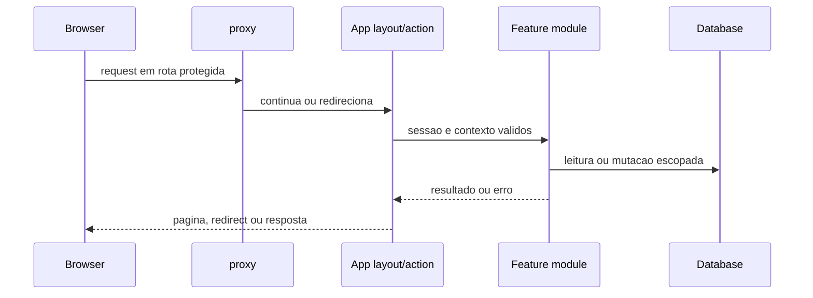

# Ciclo de request

**Status:** confirmado no codigo; detalhes de auth, RLS e billing serao aprofundados em documentos proprios.  
**Ultima verificacao:** 2026-07-14.  
**Commit analisado:** `886eda0` em `main`.

## Navegacao web protegida

1. `apps/web/src/proxy.ts:proxy` verifica cookie de sessao e redireciona visitantes para `/sign-in` nas rotas sob seu `matcher`.
2. `apps/web/src/app/(app)/layout.tsx:AppLayout` exige sessao e contexto de app antes de renderizar a area operacional.
3. A pagina chama modulos de leitura em `apps/web/src/features/**`.
4. Mutacoes partem de Server Actions, que chamam `requireAppContext` e funcoes de dominio/servidor.
5. A action invalida paths/tags pelo modulo `apps/web/src/lib/domain-invalidation.ts` quando aplicavel.

O `proxy` e explicitamente uma barreira otimista; uma rota ou action nova nao deve depender apenas dele. Evidencia: **Confirmado no codigo**.

## Route Handlers

Handlers de `apps/web/src/app/api/**/route.ts` fazem a propria validacao conforme o caso:

- `/api/health`: consulta leve ao banco e responde `503` quando indisponivel. Fonte: `apps/web/src/app/api/health/route.ts:GET`, `apps/web/src/lib/health.ts:checkDatabaseHealth`.
- `/api/product-images/presign`: exige sessao, aplica rate limit por IP e usuario, valida input e cria URL de staging. Fonte: `apps/web/src/app/api/product-images/presign/route.ts:POST`.
- `/api/product-images/...`: exige sessao, valida parametros e acesso antes de retornar bytes da imagem. Fonte: `apps/web/src/app/api/product-images/[organizationId]/[productId]/[version]/[variant]/route.ts:GET`.
- Rotas internas de R2 e reconciliacao exigem bearer, com rate limit. Fonte: `apps/web/src/app/api/internal/**/route.ts`.

## Webhooks e eventos

1. Um webhook de Asaas, Woovi ou Resend chega ao handler dedicado.
2. O handler valida configuracao, assinatura/token e tamanho antes de processar o corpo.
3. `observeWebhookIntake` captura o evento e enfileira outbox `observed`; duplicatas nao repetem o efeito.
4. Asaas/Woovi fazem reconciliacao sincrona; Resend registra evento de email.
5. O endpoint Inngest expõe jobs de outbox e reconciliacao de imagens.

Fontes: `apps/web/src/integrations/{asaas,woovi,resend}/webhook.ts`, `apps/web/src/integrations/webhooks/intake.ts:observeWebhookIntake`, `apps/web/src/app/api/inngest/route.ts`.

`asaas.webhook`, `woovi.webhook` e `resend.webhook` sao capture-only no dispatcher atual. Portanto, `observed` nao deve ser documentado como processamento assincrono concluido. Fonte: `apps/web/src/lib/inngest-functions.ts:CAPTURE_ONLY_OUTBOX_TOPICS`. Evidencia: **Confirmado no codigo**.

## Falhas e observabilidade

- Falhas do banco no health retornam `503`; a resposta nao expoe erro interno. Fonte: `apps/web/src/app/api/health/route.ts:GET`.
- Rate limit sem Upstash em producao falha fechado; fora de producao usa fallback local. Fonte: `apps/web/src/lib/rate-limit.ts:checkRateLimit`.

`apps/web/src/instrumentation.ts:register` chama `init` apenas quando `SENTRY_DSN` existe. `apps/web/src/instrumentation.ts:onRequestError` sempre invoca `captureRequestError` e escreve JSON com `message`, `path` e metadados da rota. O codigo lido nao demonstra uma lista de campos permitidos nem uma redacao especifica desses valores; portanto, a sanitizacao de logs e a entrega ao Sentry sao **lacunas nao confirmadas**, nao garantias deste fluxo.

A configuracao real de alertas, retencao de logs e disponibilidade dos provedores permanece **nao confirmada**.
