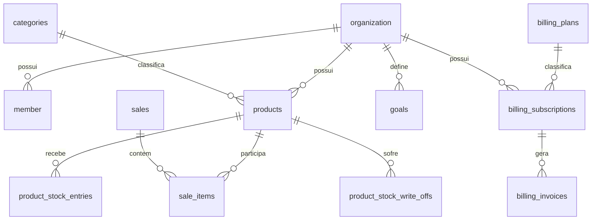

# Relações e constraints

**Status:** confirmado no schema Drizzle e migrations versionadas. **Commit:** `886eda0`.

## Relações principais

FKs compostas preservam a mesma organização entre produto e categoria, produto e seus históricos, venda e item, e ator/member em `audit_events`, `product_price_changes` e `goals`. Fonte: `packages/db/src/schema.ts` e migration inicial.

## Invariantes decisivas

| Área | Constraint/índice | Efeito |
| --- | --- | --- |
| Membership | `member_organization_user_unique_idx` | um vínculo por usuário e organização |
| Catálogo | nome e key únicos por organização | evita categorias duplicadas no tenant |
| Produto | custo, preço e estoque não negativos; índices de listagem ativo/arquivado | protege saldo persistido e soft delete |
| Venda | item com quantidade positiva; um produto por venda; regras PIX/cartão; `cancelled_at` consistente | impede payload financeiro estruturalmente inválido |
| Venda idempotente | `sales_organization_idempotency_key_unique_idx` parcial | uma venda por chave de idempotência no tenant |
| Meta | alvo positivo, fim não anterior ao início; uma `active` por organização | limita meta operacional ativa |
| Billing | uma assinatura operacional por organização para `trialing|active|past_due|paused`; links externos únicos | reduz duplicidade de cobrança/provider |
| Eventos | idempotency keys únicas de outbox/webhook; provider/event único | evita captura repetida |

`billing_subscriptions`, invoices, attempts e links aceitam estados somente pelos `CHECK` declarados. `billing_plans` é global, com intervalos `month|year` e valor não negativo.

## Concorrência e integridade de fluxo

O schema não substitui a lógica transacional: produto e venda usam bloqueios `FOR UPDATE`; o fluxo Asaas usa `pg_advisory_xact_lock` por pagamento antes de materializar invoice/link; o outbox usa claim token e lease. Ver [Vendas](../modules/sales.md), [Billing](../modules/subscriptions-and-billing.md) e [Uploads](../modules/uploads-and-images.md).

## Testes

`packages/db/src/postgres-behavior.test.ts` confirma o código PostgreSQL para idempotência de venda, isolamento e claim concorrente. `apps/web/src/db/sales-idempotency.test.ts`, `apps/web/src/db/sales-payment-invariants.test.ts` e `apps/web/src/db/goals-active-unique.test.ts` validam a presença de constraints. Não há validação desta tarefa contra o banco promovido.

## Referências

- `packages/db/src/schema.ts`
- `packages/db/src/migrations/20260704051610_initial.sql`
- `packages/db/src/postgres-behavior.test.ts`
