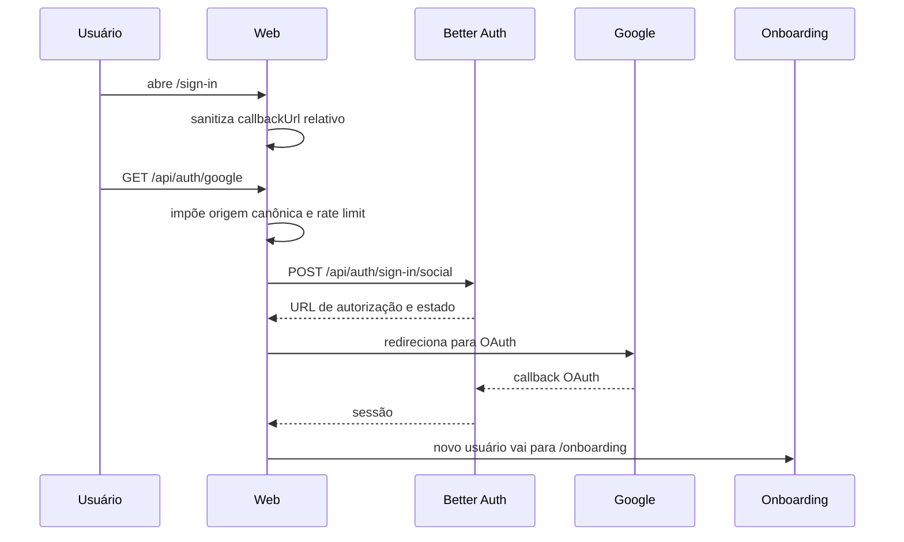

# Autenticação e sessão

**Status:** comportamento local confirmado no código; comportamento do provedor OAuth, cookies e infraestrutura externa parcialmente não confirmado.
**Última verificação:** 2026-07-14.
**Commit analisado:** `886eda0` em `main`.

## Objetivo e escopo

O Polaris usa Better Auth como handler de identidade e Google como único provider social configurável. Este documento cobre o web e a dependência de sessão do admin; não descreve uma certificação do Google, Vercel ou Better Auth em ambiente promovido.

## Configuração observada

| Área | Comportamento | Evidência |
| --- | --- | --- |
| Handler | `GET` e `POST` de `/api/auth/[...all]` são delegados para `auth.handler`. | `apps/web/src/app/api/auth/[...all]/route.ts:GET/POST`; **Confirmado no código**. |
| Provider | Google é incluído apenas quando existem ID e segredo configurados; em `production`, a ausência lança erro no boot. | `packages/auth/src/auth.ts:hasGoogleAuth`, `createPolarisAuth`; **Confirmado no código/configuração**. |
| Senha | `emailAndPassword.enabled` é `false`; `/sign-in/email` e `/sign-up/email` estão em `disabledPaths`. | `packages/auth/src/auth.ts:createPolarisAuth`; **Confirmado no código**. |
| Origem | A origem canônica forma `baseURL` e `trustedOrigins`; desenvolvimento acrescenta origens loopback conhecidas. | `packages/auth/src/app-url.ts:resolveCanonicalAppUrl`, `packages/auth/src/auth.ts:getTrustedOrigins`; **Confirmado no código**. |
| Cliente | O cliente ativa Sentinel e Google One Tap somente quando há ID público do Google. | `apps/web/src/lib/auth-client.ts:authClient`; **Confirmado no código**. |

O catálogo de providers realmente registrado, as credenciais e os callbacks cadastrados no console Google não foram verificados externamente. Não há rota de cadastro público `register` implementada no App Router; a tela de entrada é `/sign-in` e solicita Google.

## Fluxo de entrada com Google

`apps/web/src/app/api/auth/google/route.ts:GET` aceita somente `callbackUrl` iniciado por `/` e não iniciado por `//`; qualquer outro valor torna-se `/`. Se a requisição chega por origem distinta da canônica, a mesma rota redireciona antes de iniciar OAuth. O limite é 20 tentativas por chave de IP a cada minuto; excedê-lo devolve `429` com `Retry-After`.

O handler interno recebe `requestSignUp: true`, `newUserCallbackURL: "/onboarding"` e `errorCallbackURL: "/sign-in?error=google"`. Logo, a intenção implementada é permitir o primeiro acesso via Google e iniciar onboarding. O teste de rota confirma a montagem dessa solicitação, a preservação do cookie de estado e a sanitização de erro: `apps/web/src/app/api/auth/google/route.test.ts`.

## Cenários de autenticação

| Cenário | Resultado observado | Classificação e fonte |
| --- | --- | --- |
| Visitante abre área operacional | `proxy` pode redirecionar para `/sign-in`; o layout reaplica a exigência de sessão no servidor. | `apps/web/src/proxy.ts:proxy`, `apps/web/src/app/(app)/layout.tsx:AppLayout`; **Confirmado no código**. |
| Visitante abre `/sign-in` | A tela oferece Google; uma sessão já presente redireciona para callback relativo seguro. | `apps/web/src/app/(auth)/sign-in/page.tsx:SignInPage`; **Confirmado no código**. |
| Login Google novo | A rota solicita signup e direciona a `/onboarding`; a criação da conta é delegada ao Better Auth/Google. | `apps/web/src/app/api/auth/google/route.ts:GET`; **Confirmado no código para a solicitação**, criação final pelo provider **não confirmada externamente**. |
| Login Google com conta existente | A resolução da conta é delegada ao Better Auth. | `packages/auth/src/auth.ts:createPolarisAuth`; **Não confirmado por teste de integração**. |
| Email existente ou provider diferente | Linking está habilitado, não aceita emails diferentes, não desabilita linking implícito e marca Google como provider confiável. | `packages/auth/src/auth.ts:account.accountLinking`; **Confirmado na configuração**, sem teste de conflito/duplicidade. |
| Credenciais Google ausentes em produção | A factory lança erro ao inicializar. | `packages/auth/src/auth.ts:hasGoogleAuth`; **Confirmado no código**. |
| Rate limit de login excedido | Resposta JSON `429`, mensagem genérica e `Retry-After`; OAuth não inicia. | `apps/web/src/app/api/auth/google/route.ts:GET`; **Confirmado por teste**. |
| Erro ao iniciar OAuth | Redireciona para `/sign-in` com `error` igual a `body?.message` quando presente, ou `google_oauth_unavailable` caso contrário. A generalidade da mensagem e a proteção contra enumeração não estão comprovadas. | `apps/web/src/app/api/auth/google/route.ts:GET`; **Confirmado no código**. |
| Login por senha, cadastro por senha ou reset de senha | Não encontrado; senha está desabilitada e não há fluxo local de reset. | `packages/auth/src/auth.ts:createPolarisAuth`, busca de rotas/ações; **Ausente no código analisado**. |
| Usuário banido ou bloqueado | Não há campo, plugin ou guard de ban em `users`/auth analisados. | `packages/db/src/schema.ts:users`, `packages/auth/src/auth.ts`; **Ausente no código analisado**. |
| Email não verificado | Há `users.emailVerified`, mas não há guard local que o imponha para login ou app. Convites exigiriam verificação, porém a gestão de convites está bloqueada. | `packages/db/src/schema.ts:users`, `packages/auth/src/auth.ts:createOrganizationAuthPlugin`; **Comportamento de login não confirmado**. |

Não há prova suficiente para declarar proteção completa contra account enumeration: a rota Google não expõe a exceção capturada, mas os demais endpoints do Better Auth são delegados à dependência e não foram exercitados contra um provider real.

## Sessão, cookies e logout

`createSessionHelpers` lê a sessão por `auth.api.getSession({ headers })`. `requireSession` redireciona para `/sign-in` quando o resultado é nulo. A tabela `sessions` guarda identificador, token único, expiração, usuário, endereço/IP, user agent e `activeOrganizationId`.

| Aspecto | Estado documentável |
| --- | --- |
| Cookies de sessão | `nextCookies()` está instalado como último plugin. A nomenclatura, domínio, duração, `Secure`, `SameSite` e demais atributos efetivos são calculados pela dependência/configuração; não há configuração explícita suficiente no projeto para afirmá-los. |
| Expiração | Há `sessions.expiresAt`, mas a aplicação não implementa uma política própria de expiração; sua execução é responsabilidade do Better Auth e não foi verificada externamente. |
| Revogação global | Não foi encontrada ação, endpoint ou fluxo local de revogar todas as sessões. |
| Logout | `signOutAction` chama `auth.api.signOut` com os headers da requisição e redireciona para `/sign-in`. O escopo de revogação do provider não foi confirmado. |
| Auditoria | Criação de sessão registra `auth.login` apenas quando já existe `activeOrganizationId`; primeiros acessos sem organização não geram esse evento tenant-scoped. |

Fontes: `packages/auth/src/session.ts:createSessionHelpers`, `packages/db/src/schema.ts:sessions`, `apps/web/src/features/auth/actions.ts:signOutAction`, `apps/web/src/lib/auth-audit.ts:recordAuthLoginAuditEvent` e `apps/web/src/lib/auth-audit.test.ts`.

Rotas de bootstrap de sessão existem exclusivamente para desenvolvimento/teste ou E2E local isolado e exigem controle interno; elas não são mecanismo de login de produção. As condições de negação, segredo ausente, payload inválido e ambiente preview/produção são testadas em `apps/web/src/app/api/auth/dev/bootstrap-session/route.test.ts`.

## Web versus admin e sessão cross-origin

O admin instancia a mesma factory Better Auth e consulta a sessão recebida pelos headers: `apps/admin/src/lib/auth.ts:auth`, `apps/admin/src/lib/session.ts:getSession`. O preflight requer que `ADMIN_APP_URL` tenha origem distinta da origem do web em produção: `apps/web/src/ops/production-preflight.ts:validateProductionPreflight`.

Contudo, a factory usa a origem canônica do web em `baseURL` e `trustedOrigins`; `ADMIN_APP_URL` não é incluída nessa configuração. O admin não possui Route Handler Better Auth, tela de entrada ou callback próprio. Assim, o funcionamento de uma sessão Better Auth no admin em origem distinta é **não confirmado**. O E2E administra um cookie de bootstrap diretamente na origem do admin e não prova login SSO real: `apps/admin/tests/e2e/admin-access.e2e.ts:loginAsPlatformAdmin`.

## Limitações e testes ausentes

- OAuth real de usuário novo, usuário existente, linking por email e conflito entre providers.
- Enumeração de conta nos endpoints delegados ao Better Auth.
- Atributos e renovação de cookies, expiração e revogação de sessão.
- Ban/desban, reset de senha e exigência de verificação de email.
- Sessão/cookie entre origem web e origem admin distintas.

## Referências principais

- `packages/auth/src/auth.ts:createPolarisAuth`
- `packages/auth/src/session.ts:createSessionHelpers`
- `apps/web/src/app/api/auth/google/route.ts:GET`
- `apps/web/src/app/(auth)/sign-in/page.tsx:SignInPage`
- `apps/web/src/lib/auth-client.ts:authClient`
- `apps/web/src/features/auth/actions.ts:signOutAction`
