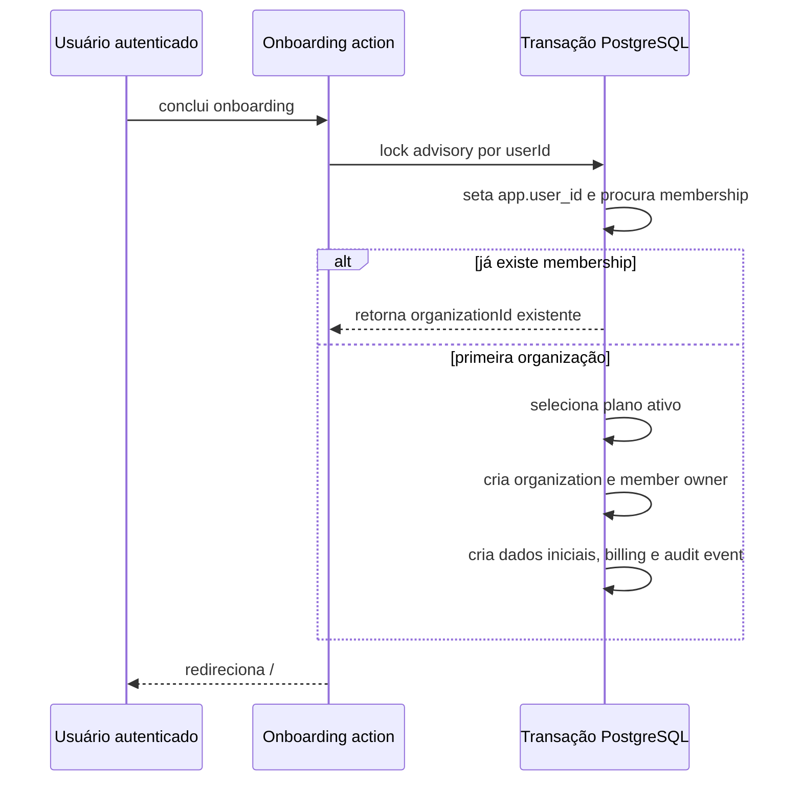

# Organizações e tenancy

**Status:** modelo e isolamento versionado confirmados; estado do banco e role de runtime em ambiente promovido não foram verificados nesta documentação.
**Última verificação:** 2026-07-14.
**Commit analisado:** `886eda0` em `main`.

## Modelo de domínio

Uma `organization` é o tenant do app web. `member` vincula `users` a organizações e contém uma das roles `owner`, `admin` ou `operator`. A combinação `(organization_id, user_id)` é única e o schema restringe as roles conhecidas.

| Entidade | Responsabilidade | Evidência |
| --- | --- | --- |
| `organization` | Tenant com `id`, nome/slug, status e timestamps. | `packages/db/src/schema.ts:organization`; **Confirmado no código**. |
| `member` | Membership, role e vínculo usuário-organização. | `packages/db/src/schema.ts:member`; **Confirmado no código**. |
| `sessions.activeOrganizationId` | Organização ativa persistida na sessão Better Auth. | `packages/db/src/schema.ts:sessions`; **Confirmado no código**. |
| `invitation` | Estrutura de convite existente, mas a gestão pelo plugin está bloqueada. | `packages/db/src/schema.ts:invitation`, `packages/auth/src/auth.ts:createOrganizationAuthPlugin`; **Confirmado no código**. |

## Criação e onboarding

O usuário autenticado sem contexto de app acessa `/onboarding`. `completeOnboardingAction` não aceita nome de organização controlado pelo cliente: chama `createInitialOrganizationForUser` com o usuário autenticado e email de billing quando presente.

A criação é transacional e usa `pg_advisory_xact_lock` por usuário antes de ler a membership. Na primeira execução, cria identidade técnica de organização, membership `owner`, categoria/default settings, cliente de billing, assinatura inicial `incomplete` (ou `active` apenas no bootstrap E2E isolado) e `audit_events` de criação. Fontes: `apps/web/src/features/onboarding/server.ts:createInitialOrganizationForUser`, `apps/web/src/features/onboarding/actions.ts:completeOnboardingAction`; testes em `apps/web/src/features/onboarding/server.test.ts` e `actions.test.ts`.

Se não houver plano de billing `active`, o onboarding falha. O cliente não escolhe nome, slug, plano, role ou organização via formulário nesse fluxo.

## Organização ativa e acesso operacional

`getAppContextFromSession` extrai `activeOrganizationId`, busca uma membership do usuário, exige `organization.status === "active"`, atualiza a sessão quando a organização ativa ainda não está definida e calcula acesso de billing da organização. `requireAppContext` também verifica a permissão solicitada.

| Situação | Resultado no app web | Fonte |
| --- | --- | --- |
| Sem sessão | `requireSession` redireciona para `/sign-in`; action guard lança erro de sessão inválida. | `packages/auth/src/session.ts:requireSession`, `apps/web/src/lib/app-session.ts:requireAppContext`. |
| Sessão sem membership elegível | Contexto nulo; páginas vão para `/onboarding`. | `apps/web/src/lib/app-session.ts:requirePageAppContext`. |
| Organização ativa sem acesso de billing | Páginas vão para `/billing-required`; actions são negadas. | `apps/web/src/lib/app-session.ts:requirePageAppContext`, `requireAppContext`. |
| Membership para organização ativa com billing liberado | Contexto inclui `organizationId`, role, usuário e status; operações podem prosseguir conforme role. | `apps/web/src/lib/app-session.ts:getAppContextFromSession`. |
| `activeOrganizationId` que não pertence ao usuário | Não retorna contexto nem reescreve a sessão. | `apps/web/src/lib/app-session.test.ts:getAppContext`. |

### Suspensão e múltiplas memberships

Há duas limitações que devem permanecer explícitas:

1. Uma organização `suspended` ou outro status diferente de `active` faz `getAppContext` retornar `null`. A página envia o usuário a `/onboarding`, mas o onboarding encontra a membership preexistente e a devolve sem reativar a organização. O redirecionamento subsequente para `/` pode retornar ao onboarding. Este é um comportamento provável do fluxo atual, sem teste de UX fim a fim, e não um mecanismo documentado de reativação.
2. Quando a sessão não tem organização ativa, a busca escolhe a primeira membership por criação, sem filtrar uma organização ativa posterior. Embora o plugin configure `membershipLimit: 1`, o schema suporta mais de uma membership e a semântica efetiva desse limite depende do Better Auth. Não há troca de organização, convite ou gestão multiusuário implementada pelo app web.

Fontes: `apps/web/src/lib/app-session.ts:resolveMembership`, `getAppContextFromSession`, `apps/web/src/features/onboarding/server.ts:createInitialOrganizationForUser`, `packages/auth/src/auth.ts:createOrganizationAuthPlugin`. O teste cobre organização inativa e active organization adulterada, não o loop de suspensão nem múltiplas memberships: `apps/web/src/lib/app-session.test.ts`.

## Gestão de membros e organizações

O plugin Better Auth configura `allowUserToCreateOrganization: false`, desabilita deleção, exige verificação para convite e instala hooks que negam adicionar/remover membro, criar convite, alterar role ou atualizar a organização. As respostas de bloqueio usam `WORKSPACE_USER_MANAGEMENT_DISABLED` ou `WORKSPACE_ORGANIZATION_UPDATE_DISABLED`.

| Operação de workspace | Estado atual |
| --- | --- |
| Criar organização pelo endpoint Better Auth | Negada pela configuração. |
| Alterar organização | Negada por hook. |
| Deletar organização | Desabilitada. |
| Convidar, adicionar, remover membro ou alterar role | Negado por hooks. |
| Trocar organização ativa | Não encontrado no código de produto. |
| Suspender/reativar organização | Somente console de platform admin, não organização admin. |

Fontes: `packages/auth/src/auth.ts:createOrganizationAuthPlugin`, `packages/auth/src/workspace-management-policy.ts:rejectWorkspaceUserManagement`, `rejectWorkspaceOrganizationUpdate`, e testes correspondentes. A efetivação de todos os endpoints pelo plugin é comportamento de dependência e não foi validada por teste de integração local.

## Matriz de permissões web

`canRolePerform` é a fonte central de permissões do app web. Todas as capacidades abaixo também pressupõem sessão válida, organização ativa e billing com acesso.

| Capacidade | Visitante | `operator` | `admin` | `owner` | Aplicação |
| --- | ---: | ---: | ---: | ---: | --- |
| `analytics:read` | Não | Sim | Sim | Sim | `apps/web/src/lib/app-context.ts:canRolePerform` |
| `catalog:read` | Não | Sim | Sim | Sim | Capability declarada no guard; a paginação de produtos/vendas usa `requireAppContext` sem exigir essa capability isoladamente. |
| `products:write` | Não | Sim | Sim | Sim | `apps/web/src/features/products/actions.ts`; presign de imagem. |
| `sales:write` | Não | Sim | Sim | Sim | `apps/web/src/features/sales/actions.ts`. |
| `settings:write` | Não | Não | Sim | Sim | catálogo/metas/configurações. |
| `organization:delete` | Não | Não | Não | Sim | Permissão declarada; não foi encontrada action web que a execute. |
| Console interno | Não | Não | Não por ser owner de organização | Não por ser owner de organização | Exige grant de platform admin separado. |

Evidência: `apps/web/src/lib/app-context.ts:ORGANIZATION_ROLES`, `canRolePerform`, `apps/web/src/lib/app-session.ts:requireAppContext`; matriz testada em `apps/web/src/lib/app-context.test.ts`.

## Isolamento em camadas

1. **Contexto de aplicação:** a sessão é confrontada com `member.userId`, `activeOrganizationId`, status da organização, billing e role.
2. **Contexto transacional:** helpers definem `app.user_id` ou `app.organization_id` com `set_config(..., true)`, limitado à transação.
3. **Schema e RLS versionados:** migrations habilitam e forçam RLS nas tabelas tenant-scoped e criam policies baseadas no contexto de transação. Também existem caminhos explícitos para jobs internos e platform admin.

Fontes: `packages/db/src/tenant-context.ts:setTenantContext`, `setUserContext`, `withTenantContext`; `packages/db/src/migrations/20260707205000_rls_tenant_isolation.sql`; `packages/db/src/migrations/20260713090000_platform_admin_rls_validation.sql`; `apps/web/src/db/rls-tenant-isolation.test.ts`.

O isolamento ativo no banco promovido, o uso de role de runtime sem `BYPASSRLS` e a aplicação de migrations não foram revalidados nesta tarefa. Filtro de aplicação não deve ser tratado como prova de RLS.

## Riscos e lacunas de teste

- Fluxo de suspensão/onboarding e seleção entre memberships múltiplas.
- Troca de organização, convites, remoção e alteração de roles estão ausentes/desativados, não apenas sem documentação.
- Isolamento cross-tenant contra banco promovido com role de runtime.
- A semântica real de `membershipLimit` do Better Auth e endpoints organizacionais requer teste de integração/documentação oficial atualizada.

## Referências principais

- `apps/web/src/lib/app-session.ts:getAppContextFromSession`
- `apps/web/src/features/onboarding/actions.ts:completeOnboardingAction`
- `apps/web/src/features/onboarding/server.ts:createInitialOrganizationForUser`
- `packages/auth/src/auth.ts:createOrganizationAuthPlugin`
- `packages/db/src/tenant-context.ts:withTenantContext`
- `packages/db/src/schema.ts:organization`, `member`, `sessions`
